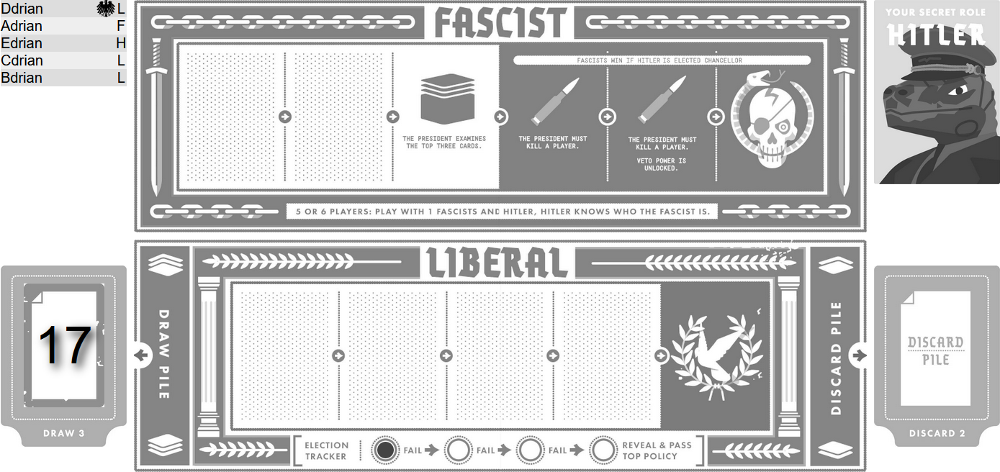

# secret-hitler

Eine Haskell Implementierung des Spiels Secret Hilter (http://www.secrethitler.com).
Hierbei handelt es sich um ein Gesellschaftsspiel für 5 bis 10 Spieler, bei dem es darum geht, den geheimen Hitler zu entlarven und zu stoppen.
Die Spieler treten in 2 Teams gegeneinander an, die Liberalen und die Faschisten.
Die Liberalen sind in der Überzahl und müssen herausfinden wer die geheimen Übeltäter sind, während Rundenweise Regierungen gute und schlechte Politiken erlassen.
Es geht darum sich gegenseitig anzulügen (zum Beispiel über Voice-Chat) und Spaß zu haben.



## License

* The images and rules are borrowed from http://www.secrethitler.com and licensed under [Creative Commons license BY–NC–SA 4.0](https://creativecommons.org/licenses/by-nc-sa/4.0/)
* The Code is licensed under [GNU General Public License v3.0](https://www.gnu.org/licenses/)

## Build

1. [Install Nix](https://nixos.org).
2. Execute

```shell
mkdir test-app
ln -s $(nix-build -A exe --no-out-link)/* test-app/
cp -r config test-app
(cd test-app && ./backend)
```

as described on https://github.com/obsidiansystems/obelisk#locally.

## Develop

[Install Obelisk](https://github.com/obsidiansystems/obelisk#installing-obelisk). The following options are available.

- Execute `ob run` for a ghcid window. The web server is updated automatically. `-- $>` code comments are supported.
- Execute `ob repl` for a ghci prompt. Load a module using `:l Game`.
- In the directory `backend`, execute `ob shell` and then `cabal run :test` to execute `main` in `test/main.hs`.
